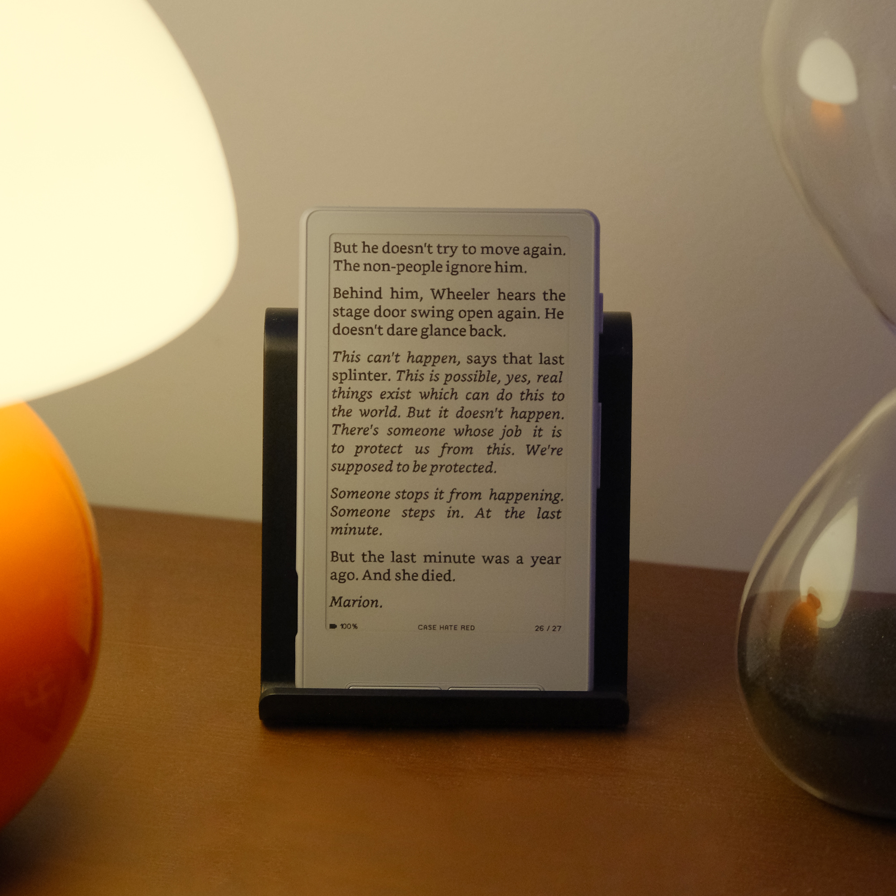

# Paperonii

Paperonii는 [CrossPoint Reader](https://github.com/crosspoint-reader/crosspoint-reader)를 기반으로 시작한 **Xteink X4 Pro용 커스텀 펌웨어 프로젝트**입니다. 자체 개발 이력을 사용하며, 고유한 기능과 방향으로 발전시키는 독립 프로젝트를 지향합니다.

## 프로젝트 상태

현재는 저장소 초기화 단계이며, Paperonii 고유의 펌웨어 변경이나 배포본은 아직 없습니다. 기존 코드와 서브모듈을 그대로 유지하며, Xteink X4 Pro를 위한 기능 개발과 기기 검증은 후속 작업으로 진행합니다.

## 원본 프로젝트와 라이선스

- 프로젝트 저장소: [An-d-u/Paperonii](https://github.com/An-d-u/Paperonii)
- 기반 프로젝트: **CrossPoint Reader**
- 원본 저장소: [crosspoint-reader/crosspoint-reader](https://github.com/crosspoint-reader/crosspoint-reader)
- 라이선스: 원본의 [MIT LICENSE](./LICENSE)를 그대로 유지합니다.

원본 저작권 고지와 라이선스 문구는 변경하지 않습니다. 기반 펌웨어를 만든 CrossPoint Reader의 원저작자와 기여자들에게 감사를 표합니다. 포함된 서브모듈과 외부 구성 요소의 라이선스 및 저작권 고지도 그대로 유지합니다.

Paperonii는 CrossPoint Reader에서 파생된 독립 프로젝트이며, CrossPoint Reader의 공식 배포본이 아닙니다.

## 코드 출처와 개발 이력

초기 펌웨어 코드는 CrossPoint Reader의 다음 커밋을 기준으로 가져왔습니다.

- 원본 기준 커밋: [`3f874f8472280398c3d1900ab66450583c101e7a`](https://github.com/crosspoint-reader/crosspoint-reader/commit/3f874f8472280398c3d1900ab66450583c101e7a)
- 서브모듈: 해당 커밋에 기록된 `freeink-sdk`와 그 안의 `lucide` 버전을 그대로 사용합니다.

Paperonii의 첫 커밋은 기존 코드를 가져온 출발점이며, 기반 코드를 새로 작성했다는 의미가 아닙니다. 원본 전체 Git 이력은 별도 백업으로 보존하고, 이 저장소의 개발 이력과 향후 버전 태그는 Paperonii에서 새로 시작합니다. 원본 코드의 저작권과 기여 내역은 위 원본 저장소에서 확인할 수 있습니다.

## 저장소 받기

```bash
git clone --recurse-submodules https://github.com/An-d-u/Paperonii
cd Paperonii
git remote add upstream https://github.com/crosspoint-reader/crosspoint-reader
```

이미 복제한 저장소에서 서브모듈을 준비하려면 다음 명령을 실행합니다.

```bash
git submodule update --init --recursive
```

`origin`은 Paperonii 저장소를, `upstream`은 원본 CrossPoint Reader 저장소를 가리킵니다. 원본의 새 변경 사항은 `git fetch upstream`으로 확인합니다. 두 프로젝트의 개발 이력에는 공통 조상이 없으므로, 필요한 변경을 비교·검토한 뒤 패치를 선별해 반영합니다.

## 원본 CrossPoint Reader 문서

아래에는 원본 README를 보존합니다. 아래의 기능 소개, 로드맵, 기여 안내, 설치 및 배포 링크는 **원본 CrossPoint Reader 기준**이며, Paperonii의 배포나 기기 검증을 의미하지 않습니다.

---

# CrossPoint Reader

[](https://app.royalty.dev/crosspoint-reader/crosspoint-reader)

CrossPoint is open-source e-reader firmware - community-built, fully hackable, free forever. It's maintained by a growing community of developers and readers who believe your device should do what you want - not what a manufacturer decided for you.

### Now running on:
- **ESP32C3-based** Xteink X4 and X3.
- **ESP32S3-based** Xteink X4Pro, Seeed reTerminal Sticky, M5PaperMono

Check [our Devices page](https://crosspointreader.com/devices) for the full list.



> If you're planning to buy an Xteink device, consider purchasing an **X3/X4 Developer Edition** through https://crosspointreader.com. CrossPoint receives a small share of each sale, helping fund development costs.

## What can CrossPoint do?

- **Reader engine**: EPUB 2/3 rendering with embedded-style option, image handling, hyphenation, kerning, adaptive table layouts, native CJK ruby annotations, chapter navigation, footnotes, bookmarks, dictionary lookups ([StarDict](docs/dictionary.md)), go-to-percent, auto page turn, orientation control, focus reading, KOReader progress sync and more.

- **Various formats**: native handling for `.epub`, `.xtc/.xtch`, `.txt`, and `.bmp`.

- **Touch reading**: follow EPUB links and look up words in the dictionary on touch-enabled devices.

- **Screenshots.**

- **Custom fonts**: install your favorite fonts on the SD card.

- **Tilt page turn (X3 and Sticky)**.

- **USB Drive mode (X4Pro)**: access the SD card as USB mass storage.

- **Library workflow**: indexed title/author search, recently-added and alphabetical views, multilingual grouping, folder browser, recent books, and SD-cache management.

- **Wireless workflows**:
  
  - File transfer web UI
  - EPUB Optimizer
  - Web settings UI/API (edit many device settings from browser)
  - WebSocket fast uploads
  - WebDAV handler
  - AP mode (hotspot) and STA mode (join existing Wi-Fi), both with QR helpers
  - Calibre wireless connect flow
  - OPDS browser with saved servers (up to 8), search, pagination, and direct download
  - OTA update checks and installs from GitHub releases

- **Customization**: night mode, multiple themes (Classic, Lyra, Lyra Extended, RoundedRaff), sleep screen modes including transparent overlays, front/side button remapping, status bar controls, power-button behavior, refresh cadence, and more.

- **Localization**: 34 UI languages and counting, including CJK font fallback and RTL support.

### Coming soon:

- More themes.

- Web plugins.

- Bluetooth pageturner.

- Much more! stay tuned.

---

## USB-locked devices (Xteink Unlocker)

Some Xteink units purchased from third-party stores (e.g. AliExpress) ship with USB flashing locked from the factory.
If your device is locked, you will need to use the **Xteink Unlocker** tool available at
https://crosspointreader.com/#unlock-tool before you can flash CrossPoint.

**You do not need this tool if you bought your device directly from xteink.com.** Those units are not locked.

**Not sure if your device is locked?** Power it on, connect the USB-C cable, and try flashing via the web flasher first (see
[Install firmware](#install-firmware) below). If the browser's serial device picker does not show your device, try a different
USB port or browser before assuming the device is locked. Only reach for the unlocker if the device still doesn't appear.

> ### ⚠️ WARNING: READ THIS BEFORE USING THE UNLOCKER ⚠️
> 
> **The only officially supported firmwares in the unlock tool are CrossPoint and CrossInk.**
> 
> Flashing any other firmware on a USB-locked device may **permanently brick the device** or leave it **permanently
> stuck on that firmware with no recovery path**. Once USB flashing is re-locked, your only way back is via OTA, and if
> the firmware you flashed doesn't support OTA, **there is no way out**.

## Install firmware

### Web installer (recommended)

1. Connect your device to your computer via USB-C and wake/unlock the device
2. Go to https://crosspointreader.com/#flash-tools, select your device (X3, X4, Xteink X4Pro, Seeed reTerminal Sticky, or M5PaperMono), and choose an official CrossPoint release.

### Web installer (specific version)

1. Connect your device to your computer via USB-C and wake/unlock the device
2. Download the firmware file for your device from [Releases](https://github.com/crosspoint-reader/crosspoint-reader/releases), or compile yourself.
3. Go to https://crosspointreader.com/#flash-tools, select your device, click "Custom .bin" and upload the firmware file.

### Revert to Official Firmware

To revert to the official firmware, you can also flash the latest official firmware using https://crosspointreader.com/#flash-tools.

### Command line

1. Install [`esptool`](https://github.com/espressif/esptool):

```bash
pip install esptool
```

2. Download the firmware file for your device from the [releases page](https://github.com/crosspoint-reader/crosspoint-reader/releases).
3. Connect your device via USB-C.
4. Find the device port. On Linux, run `dmesg` after connecting. On macOS:

```bash
log stream --predicate 'subsystem == "com.apple.iokit"' --info
```

5. Flash an X3 or X4:

```bash
esptool.py --chip esp32c3 --port /dev/ttyACM0 --baud 921600 write_flash 0x10000 /path/to/firmware.bin
```

   Flash an Xteink X4Pro, Seeed reTerminal Sticky, or M5PaperMono:

```bash
esptool.py --chip esp32s3 --port /dev/ttyACM0 --baud 921600 write_flash 0x10000 /path/to/firmware.bin
```

### Manual

See [Development quick start](#development-quick-start) below.

---

## Custom SD-card fonts

Convert your own TTF/OTF files into `.cpfont` files that load from the SD card. No firmware reflash is needed.

1. Go to https://crosspointreader.com/fonts and open the "SD-card font builder" form.
2. Upload up to four styles (regular, bold, italic, bold-italic), set the family name, point sizes, and Unicode range.
3. Download the generated `.cpfont` files.
4. Copy them to your SD card under `/fonts/YourFont/` (or `/.fonts/YourFont/` to hide the folder).
5. Select the font on the device from the font settings.

Conversion runs the firmware repo's `lib/EpdFont/scripts/fontconvert_sdcard.py` script unmodified, so output matches a local host build.

---

## Documentation

- [User Guide](./USER_GUIDE.md)
- [Web server usage](./docs/webserver.md)
- [Web server endpoints](./docs/webserver-endpoints.md)
- [Project scope](./SCOPE.md)
- [Contributing docs](./docs/contributing/README.md)
- [Touch and UI development](./docs/contributing/touch-and-ui.md) - how to build new screens on the FreeInkUI activity bases (UiListActivity and friends), plus build envs for the non-Xteink touch devices

---

## Development quick start

### Prerequisites

- [pioarduino PlatformIO Core](https://github.com/pioarduino/platformio-core) or [VS Code + pioarduino IDE](https://github.com/pioarduino/pioarduino-vscode-ide)
- Python 3.8+
- `clang-format` 21
- USB-C cable supporting data transfer

### Setup

```bash
git clone --recursive https://github.com/crosspoint-reader/crosspoint-reader
cd crosspoint-reader

# if cloned without --recursive:
git submodule update --init --recursive
```

### Nix/NixOS

Nix/NixOS users can enter the development shell with either `nix develop` (flakes) or `nix-shell`:

```bash
nix develop -f nix
# or
nix-shell nix
```

To flash a connected ESP32-C3 device, enable PlatformIO's udev rules in your NixOS configuration:

```nix
services.udev.packages = with pkgs; [ platformio-core.udev ];
```

After rebuilding the system configuration, reconnect the device or reload udev rules.

### Build / flash / monitor

```bash
pio run --target upload
```

### Contributor pre-PR checks

```bash
./bin/clang-format-fix
pio check -e default
pio run -e default
```

### Debugging

After flashing the new features, it’s recommended to capture detailed logs from the serial port.

First, make sure all required Python packages are installed:

```python
python3 -m pip install pyserial colorama matplotlib
```

After that run the script:

```sh
# For Linux
# This was tested on Debian and should work on most Linux systems.
python3 scripts/debugging_monitor.py

# For macOS
python3 scripts/debugging_monitor.py /dev/cu.usbmodem2101
```

Minor adjustments may be required for Windows.

---

## Internals

CrossPoint Reader is pretty aggressive about caching data down to the SD card to minimise RAM usage. The ESP32-C3 only has ~380KB of usable RAM, so we have to be careful. A lot of the decisions made in the design of the firmware were based on this constraint.

### Data caching

The first time chapters of a book are loaded, they are cached to the SD card. Subsequent loads are served from the
cache. This cache directory exists at `.crosspoint` on the SD card. The structure is as follows:

```text
.crosspoint/
├── epub_<hash>/         # one directory per book, named by content hash
│   ├── progress.bin     # reading position (chapter, page, etc.)
│   ├── cover.bmp        # generated cover image
│   ├── book.bin         # metadata: title, author, spine, TOC
│   ├── css_rules.cache  # parsed CSS rule cache
│   ├── img_*            # rendered image cache files
│   └── sections/        # per-chapter layout cache
│       ├── 0.bin
│       ├── 1.bin
│       └── ...
├── settings.json        # device settings
├── state.json           # resume/runtime state
└── recent.json          # recent books list
```

Removing `/.crosspoint` clears all cached metadata and forces a full regeneration on next open. Book deletes, overwrites, and moves done through the firmware or web UI clear or re-key matching caches; manual SD-card edits may leave stale cache directories behind.

For more details on the internal file structures, see the [file formats document](./docs/file-formats.md).

---

## Contributing

Contributions are welcome. If you're new to the codebase, start with the [contributing docs](./docs/contributing/README.md). For things to work on, check the [ideas discussion board](https://github.com/crosspoint-reader/crosspoint-reader/discussions/categories/ideas) — leave a comment before starting so we don't duplicate effort.

Everyone here is a volunteer, so please be respectful and patient. For governance and community expectations, see [GOVERNANCE.md](./GOVERNANCE.md).

---

## Community forks

One of the best things about open source is that anyone can take the code in a different direction. If you need something outside CrossPoint's [scope](./SCOPE.md), check out the community forks:

- [CrossInk](https://github.com/uxjulia/CrossInk) — UX focused with minimal reading stats and broader customizations for the reading experience.

- [papyrix-reader](https://github.com/bigbag/papyrix-reader) — Adds FB2 and MD format support. Actively maintained with Arabic script support. Custom themes.

- [inx](https://github.com/obijuankenobiii/inx) — Completely reimagines the user interface with tabbed navigation.

- [Witch(hunt) Reader](https://github.com/jpirnay/witchhunt-reader) — More faithful CSS styling and background work for slightly snappier interaction. Weather information panel. Markdown support.

**Note:** Many of these features will make their way into CrossPoint over time. Each project chooses its own priorities and tradeoffs.

Want to build your own device? Be sure to check out the [de-link](https://github.com/iandchasse/de-link) project or [OnePage Reader](https://github.com/MoveCall/onepage-reader).

---

CrossPoint Reader is **not affiliated with Xteink or any device manufacturer**.
